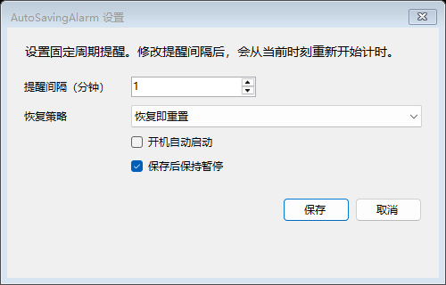
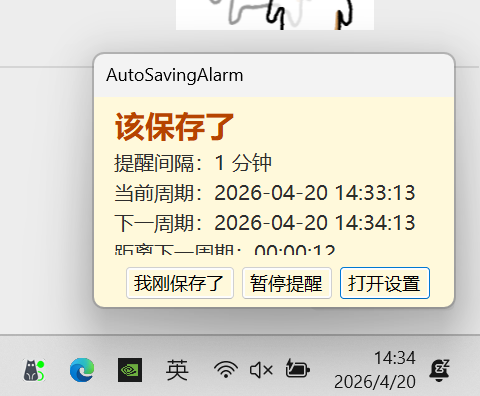

<div align="center">

# AutoSaving Alarm

### 提醒你及时保存工作的 Windows 托盘小工具

不接管编辑器，不绑定特定软件，也不做复杂自动同步。  
它只做一件事：在你最容易忘记保存的时候，稳定地提醒你一下。

[](https://github.com/zhujiu39/alarm-autosave/releases)
[](https://github.com/zhujiu39/alarm-autosave/commits/main)
[](https://github.com/zhujiu39/alarm-autosave)
[](https://dotnet.microsoft.com/)
[](LICENSE)

[下载 Release](https://github.com/zhujiu39/alarm-autosave/releases) |
[版本选择](#-下载与版本选择) |
[快速开始](#-快速开始) |
[FAQ](#-faq) |
[本地开发](#-本地开发)

</div>

> [!TIP]
> 如果你只是想直接用，不想研究 .NET 运行时，直接下载 `AutoSavingAlarm-v1.1.0-self-contained-win-x64.zip`。

## ✨ 一眼看懂

| 这个工具解决什么问题 | 它怎么工作 | 最适合谁 |
| --- | --- | --- |
| 你明明有手动保存习惯，但一专注就忘了按 `Ctrl + S` | 可以选择保持固定周期，或在确认“我已保存”后重新开始计时；也可以在忙不过来时先“稍后提醒”，并限制只在工作时段内提醒 | 写文档、写脚本、做设计、整理笔记时依赖手动保存，而且不想被全天候打扰的人 |

很多时候，真正让人崩溃的不是软件闪退，而是你已经做了二十分钟，结果忘了按一次 `Ctrl + S`。

`AutoSaving Alarm` 针对的就是这种场景：

- 常驻托盘，不打断主工作流
- 到点提醒，但不过度骚扰
- 支持固定节奏，也支持确认后重新倒计时
- 支持稍后提醒、工作时段和空闲挂起

## 🖼️ 界面预览

| 设置窗口 | 到点提醒 |
| --- | --- |
|  |  |
| 首次启动时配置提醒间隔、确认策略、恢复策略和开机启动 | 到点后通过提醒窗处理当前周期 |

## 🔥 核心特性

- **双模式确认策略**
  - 可选择“确认后重置周期”
  - 也可选择保持固定周期，不因一次确认而顺延整体节奏
- **托盘常驻**
  - 默认运行在系统托盘
  - 双击托盘图标可打开设置
  - 托盘菜单支持恢复、暂停、确认已保存、稍后提醒、设置和退出
- **双通道提醒**
  - 托盘气泡通知
  - 右下角置顶提醒窗
- **稍后提醒**
  - 当下正忙时，可先将当前提醒延后几分钟
  - 稍后结束后会按真实逾期情况恢复提醒等级
- **未确认升级提醒**
  - 连续多个周期未确认时，提醒窗颜色更强烈
  - 更高等级会触发更明显的闪烁，可按需开启声音提示
- **工作时段与空闲检测**
  - 可限制只在指定星期和时间段内提醒
  - 长时间无人操作时会自动挂起提醒，回到电脑后重新计时
- **本地持久化**
  - 自动保存提醒间隔、确认策略、稍后提醒时长、工作时段、空闲检测、暂停状态、开机启动等设置
- **配置备份恢复**
  - 自动维护最近一次可用备份
  - 主配置损坏时可自动从备份恢复
- **开机自启动**
  - 使用当前用户注册表启动项
  - 不要求管理员权限
- **单实例保护**
  - 避免多个托盘进程重复运行

## 🧠 为什么它不是普通倒计时提醒器

这个工具现在支持两种确认语义：

- **确认后重置周期**
  - 你点一次“我已保存”
  - 下一次提醒从当前时刻重新开始计时
- **保持固定周期**
  - 你点一次“我已保存”
  - 只结束当前提醒，不改变整体节奏

例如提醒间隔设为 `15` 分钟、开始于 `10:00`：

- 如果开启“确认后重置周期”
  - 你在 `10:16` 确认后，下一次提醒是 `10:31`
- 如果关闭“确认后重置周期”
  - 你在 `10:16` 确认后，下一次提醒仍然是 `10:30`

同时，它也不是“点一次就永远安静”的提醒器：

- 如果你连续几个周期都没有确认
- 提醒窗会变得更明显
- 如果你开启了声音提示，提示音也会升级

这就是它和普通倒计时提醒器的核心区别：**确认策略可选，而且未确认会逐级升级。**

## 📦 下载与版本选择

Release 页面：

[https://github.com/zhujiu39/alarm-autosave/releases](https://github.com/zhujiu39/alarm-autosave/releases)

当前提供两个版本：

| 你的情况 | 建议下载 | 说明 |
| --- | --- | --- |
| 我只想下载后直接运行 | `AutoSavingAlarm-v1.1.0-self-contained-win-x64.zip` | 自带 Runtime，最省事，体积较大 |
| 我已经装过 `.NET 10 Windows Desktop Runtime` | `AutoSavingAlarm-v1.1.0-runtime-dependent-win-x64.zip` | 不自带 Runtime，体积较小 |
| 我不确定自己有没有装运行时 | `AutoSavingAlarm-v1.1.0-self-contained-win-x64.zip` | 这是默认推荐版本 |

## ⚡ 快速开始

### 第一次使用

1. 从 Releases 下载合适的版本
2. 启动程序
3. 设置提醒间隔
4. 选择是否开机启动
5. 选择恢复策略
6. 选择“确认后是否重置周期”
7. 选择默认“稍后提醒”时长
8. 选择是否启用工作时段或空闲检测
9. 选择是否启用声音提示
10. 保存设置

如果本地还没有配置，程序会自动打开设置窗口。

### 日常使用

- 程序平时驻留在系统托盘
- 到点时会显示托盘提醒
- 同时弹出右下角置顶提醒窗
- 点击“我已保存”
  - 若开启“确认后重置周期”，则从当前时刻重新开始计时
  - 若关闭“确认后重置周期”，则只结束当前提醒，保持固定节奏
- 点击“稍后提醒”
  - 当前提醒先关闭
  - 过几分钟后再恢复提醒
- 可在设置里关闭声音提示，适合办公室等需要静音的环境
- 可在设置里限定工作时段，避免下班后继续提醒
- 如果你离开电脑一段时间
  - 程序会自动挂起提醒
  - 回来后从当前时刻重新开始计时
- 如果连续多个周期不确认
  - 提醒窗会逐级强化
  - 若开启声音提示，提示音也会更明显
- 点击“暂停提醒”
  - 暂停后续提醒
  - 直到你手动恢复

### 恢复策略说明

| 策略 | 含义 |
| --- | --- |
| `恢复即重置` | 恢复提醒时，从当前时刻重新开始计时 |
| `沿用旧锚点` | 恢复提醒时，继续沿用之前的周期节奏 |

## 🎯 适用场景

这个工具尤其适合下面这些使用习惯：

- 写文档、写周报、整理笔记时依赖手动保存
- 写脚本、改配置、做原型时没有自动保存兜底
- 长时间专注工作，容易忽略保存动作
- 不想装复杂同步工具，只想要一个稳定提醒器

## ❓ FAQ

<details>
<summary><strong>为什么发布包这么大？</strong></summary>

因为 Release 同时提供了一个“自带 Runtime”的版本。

这个版本把 `.NET` 运行时一起打包进去了，优点是：

- 下载后直接运行
- 不要求用户自己安装依赖
- 更适合普通用户直接使用

代价就是体积会明显更大。  
如果你更在意体积，可以改用 `runtime-dependent` 版本。

</details>

<details>
<summary><strong>两个版本到底怎么选？</strong></summary>

最简单的判断方式：

- 想省事：下载 `self-contained`
- 知道自己机器已经装了 `.NET 10 Windows Desktop Runtime`：下载 `runtime-dependent`

如果你不能确定，就默认下载自带 Runtime 的版本。

</details>

<details>
<summary><strong>这个工具会自动帮我保存文件吗？</strong></summary>

不会。

它的职责是提醒你保存，而不是接管你的软件行为。  
这样做的好处是简单、稳定、兼容场景多，不需要适配具体编辑器，也不会误操作你的文件。

</details>

<details>
<summary><strong>它和普通倒计时提醒器最大的区别是什么？</strong></summary>

最大的区别是：**它把“确认之后怎么计时”做成了可选策略，而且未确认会升级提醒强度。**

你可以在设置里选择：

- 确认后重新计时
- 确认后保持固定周期

如果你一直不确认，提醒也不会永远停留在同一强度，而会继续升级。

另外，声音提示也是可选的，适合在办公室关闭、在家里开启。

</details>

<details>
<summary><strong>为什么下班后没有提醒我？</strong></summary>

如果你启用了“工作时段”，程序只会在你配置的星期和时间范围内提醒。

这意味着：

- 工作时段外不会弹窗
- 不会继续升级提醒
- 下一个工作时段开始时，会从当前时刻重新开始计时

</details>

<details>
<summary><strong>为什么我离开电脑回来后，没有立刻出现高等级提醒？</strong></summary>

如果你启用了“空闲检测”，程序会在检测到长时间无人操作后自动挂起提醒。

这样做是为了避免你人不在电脑前时，提醒无意义地一路升级。  
当你重新回到电脑后，程序会从当前时刻重新开始计时，而不是直接给你一个积压的高等级提醒。

</details>

<details>
<summary><strong>关闭提醒窗会退出程序吗？</strong></summary>

不会。

程序的常驻入口在系统托盘。  
提醒窗只是当前周期的提醒界面，不是整个应用的主窗口。真正退出需要从托盘菜单里执行。

</details>

<details>
<summary><strong>支持开机自启动吗？需要管理员权限吗？</strong></summary>

支持。

当前版本使用当前用户注册表启动项：

- 路径：`HKCU\Software\Microsoft\Windows\CurrentVersion\Run`
- 不要求管理员权限

</details>

<details>
<summary><strong>配置文件存在哪里？</strong></summary>

默认保存在：

```text
%AppData%\AutoSavingAlarm\settings.json
```

最近一次可用备份默认保存在：

```text
%AppData%\AutoSavingAlarm\settings.backup.json
```

其中会记录：

- 提醒间隔
- 确认后是否重置周期
- 默认稍后提醒时长
- 是否启用声音提示
- 是否启用工作时段
- 工作日期与时间范围
- 是否启用空闲检测
- 空闲阈值
- 是否开机自启动
- 是否暂停
- 锚点时间
- 上次确认已保存时间
- 恢复策略

</details>

<details>
<summary><strong>支持 macOS 或 Linux 吗？</strong></summary>

当前不支持。  
目前版本只支持 `Windows`。

</details>

<details>
<summary><strong>配置损坏了怎么办？</strong></summary>

当前版本会自动维护最近一次可用备份。

- 如果主配置损坏，程序会优先尝试从备份恢复
- 如果你想手动恢复，也可以在设置页点击“恢复最近备份”
- 如果主配置和备份都损坏，程序会回退默认配置，并保留损坏文件副本，方便排查

</details>

## 📝 更新日志

### v1.2.0（当前仓库开发中）

- 新增“稍后提醒”，支持按默认时长延后当前提醒
- 新增工作时段设置，可限制仅在指定星期和时间段内提醒
- 新增空闲检测，长时间无操作时自动挂起提醒并在回到电脑后重新计时
- 新增主配置自动备份与损坏恢复入口
- 更新托盘菜单、提醒窗、设置页和 README 文案，统一新语义

### v1.1.0

- 新增“确认后重置周期”开关，支持固定周期和闭环重计时两种模式
- 新增连续未确认升级提醒，包含更明显的提示窗表现和可选声音提示
- 更新托盘、设置页和 README 文案，统一为双模式提醒语义

### v1.0.0

- 提供固定周期提醒，不因确认一次已保存而重置整体节奏
- 提供托盘常驻、托盘菜单和单实例保护
- 提供右下角提醒窗与托盘气泡通知
- 提供本地配置持久化与开机自启动
- 提供自带 Runtime 和依赖本机 Runtime 两种发布包

## 🗺️ 路线图

- [ ] 补一张托盘状态截图，让 README 的界面展示更完整
- [ ] 增加可配置提示音和每级提醒强度设置
- [ ] 支持自定义提醒文案和提醒间隔预设
- [ ] 支持每天多个工作时段
- [ ] 增加基础自动化测试，覆盖配置损坏与启动项同步边界
- [ ] 继续打磨 README 的首屏视觉和下载指引

## 🧩 技术实现

核心模块包括：

- `TrayAppContext`
  - 管理托盘图标、菜单和程序生命周期
- `ReminderScheduler`
  - 负责提醒周期、确认策略、稍后提醒和升级状态流转
- `SettingsStore`
  - 负责本地 JSON 配置读写、备份与恢复
- `AutostartService`
  - 负责开机自启动注册表项
- `WorkScheduleEvaluator`
  - 负责判断当前是否处于工作时段
- `UserIdleMonitor`
  - 负责检测用户是否长时间无操作
- `ReminderWindow`
  - 负责右下角提醒窗展示与“稍后提醒”交互
- `SettingsForm`
  - 负责提醒间隔、确认策略、稍后提醒、工作时段、空闲检测、恢复策略、自启动等设置

## 🗂️ 项目结构

```text
alarm-autosave/
├─ src/AutoSavingAlarm/
│  ├─ Application/      # 托盘生命周期与主流程
│  ├─ Configuration/    # 配置模型与持久化
│  ├─ Services/         # 调度、自启动等服务
│  └─ UI/               # 提醒窗、设置窗、图标
├─ artifacts/           # 本地发布产物
├─ assets/readme/       # README 使用的图片资源
├─ PLAN.md              # 方案说明与测试计划
├─ README.md
└─ LICENSE
```

## 🛠️ 本地开发

环境要求：

- Windows
- .NET 10 SDK

构建：

```powershell
dotnet build .\src\AutoSavingAlarm\AutoSavingAlarm.csproj
```

发布自带 Runtime 的版本：

```powershell
dotnet publish .\src\AutoSavingAlarm\AutoSavingAlarm.csproj -c Release -o .\artifacts\publish
```

发布依赖本机 Runtime 的轻量版本：

```powershell
dotnet publish .\src\AutoSavingAlarm\AutoSavingAlarm.csproj -c Release -p:RuntimeIdentifier=win-x64 -p:SelfContained=false -p:PublishSingleFile=true -o .\artifacts\publish-fd-single-explicit
```

## 🚧 已知边界

- 当前仅支持 Windows
- 当前不监听“你是不是真的保存了文件”
- 当前不支持 macOS
- 当前不支持 Linux
- 当前不提供云同步、全局快捷键
- 当前不支持每天多个工作时段，也不支持节假日日历
- 当前不支持自定义每一级提醒强度

## 📄 许可证

本项目采用自定义非商用许可证：

- 允许个人使用
- 允许学习研究
- 允许修改和再分发
- 不允许商业用途

详见 [LICENSE](LICENSE)。
